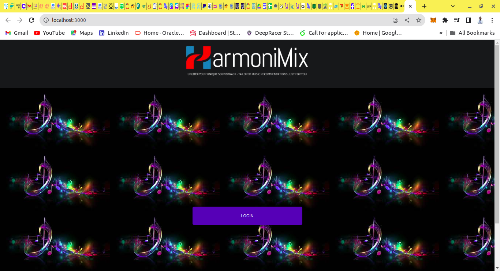
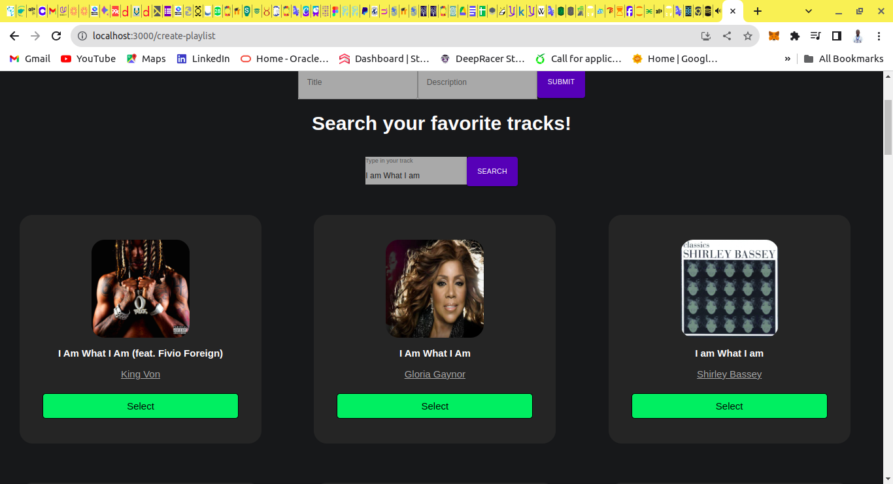
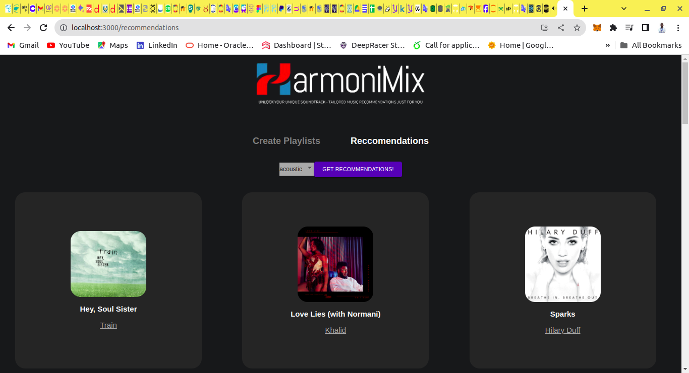

# HarmoniMix

Welcome to HarmoniMix - Your Personalized Music Recommendation Platform!


## Table of Contents

- [Introduction](#introduction)
- [Features](#features)
- [Screenshots](#screenshots)
- [Getting Started](#getting-started)
  - [Prerequisites](#prerequisites)
  - [Installation](#installation)
  - [Spotify API Setup](#spotify-api-setup)
- [Usage](#usage)
- [Contributing](#contributing)
- [Related Projects](#related-projects)
- [License](#license)
- [Resources](#resources)

## Introduction

HarmoniMix is a web-based music recommendation platform that leverages a dynamic algorithm to curate personalized playlists based on user preferences. Whether you're a music enthusiast or someone discovering new genres, HarmoniMix tailors recommendations to suit your unique taste.

### Deployed Site

Visit [HarmoniMix](#) to experience personalized music recommendations.

### Final Project Blog Article

Read our blog article [here](#) to learn more about the development process and project insights.

### Authors

- [Guy Ahonakpon GBAGUIDI](linkedin.com/in/guy-ahonakpon-gbaguidi)

## Features

- **Personalized Recommendations:** Receive song suggestions tailored to your preferences.
- **Interactive UI:** Engage with a visually appealing and responsive user interface.
- **Search Functionality:** Explore specific genres, artists, or songs with the built-in search feature.
- **User Feedback Mechanism:** Like or dislike songs to provide feedback and improve future recommendations.

## Screenshots


*Caption for Screenshot 1*


*Caption for Screenshot 2*


*Caption for Screenshot 3*

...

## Getting Started

### Prerequisites

Before running HarmoniMix, ensure you have the following installed:

- [Node.js](https://nodejs.org/)
- [npm](https://www.npmjs.com/)

### Installation

1. Clone the repository:

   ```bash
   git clone https://github.com/ggbaguidi/HarmoniMix.git
   ```

2. Install dependencies:

   ```bash
   cd HarmoniMix
   npm install
   ```

3. Start the application:

   ```bash
   npm start
   ```

### Spotify API Setup

To use HarmoniMix, you'll need to set up a Spotify Developer account and create an application to obtain the required credentials.

1. Go to the [Spotify Developer Dashboard](https://developer.spotify.com/dashboard/) and log in or sign up for a Spotify account.

2. Create a new application and note down the `Client ID`.

3. Set the Redirect URI in your Spotify application settings to `https://localhost:3000/callback` or the URL where your local instance is running.

4. Create a `.env` file in the root of your project and add the following:

   ```env
   REACT_APP_CLIENT_ID=your_spotify_client_id
   REACT_APP_CLIENT_SECRET=your_spotify_client_secret
   ```

   Replace `your_spotify_client_id` and `your_spotify_client_secret` with the values from your Spotify application.

5. Restart your HarmoniMix application.

Now, you're all set to run HarmoniMix locally with Spotify integration!

## Usage

Describe how to use the application. Provide examples or commands to navigate the interface or features.

## Contributing

Guidelines for contributing to the project.

## Related Projects

List any related projects or repositories that users might find interesting.

## License

This project is licensed under the [License Name] - see the [LICENSE](LICENSE) file for details.

## Resources

- [What your code repository says about you](https://blog.newrelic.com/engineering/what-your-code-repository-says-about-you/)
- [Here’s an awesome list of READMEs](https://github.com/matiassingers/awesome-readme)


This version includes a section on setting up the Spotify API for local development, guiding users through the process. Please replace `your_spotify_client_id` and `your_spotify_client_secret` with the actual credentials from your Spotify Developer account.
